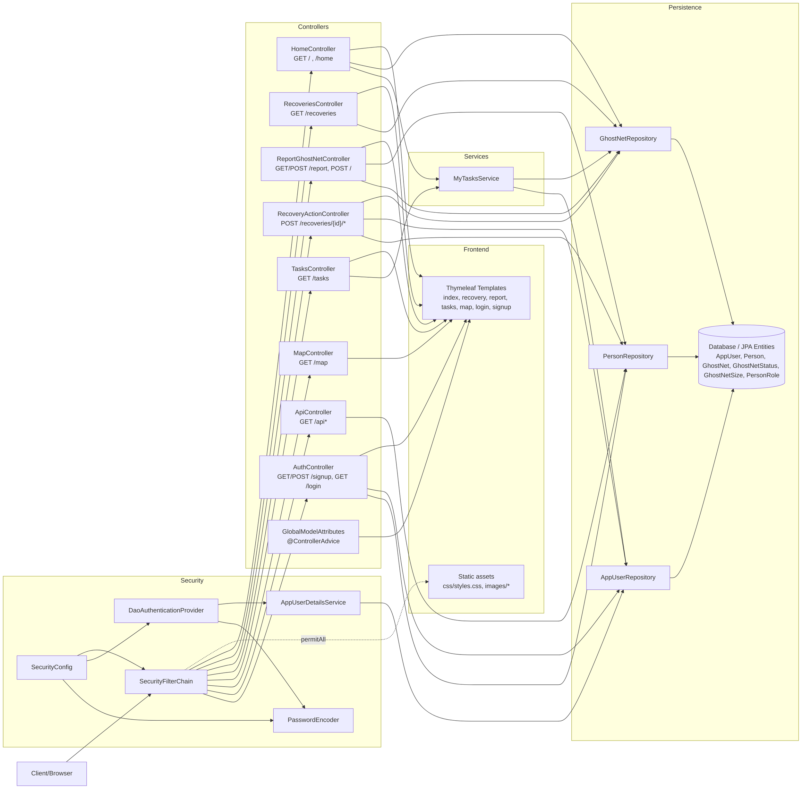

```mermaid
%%{init: {'flowchart': {'useMaxWidth': false, 'nodeSpacing': 55, 'rankSpacing': 70, 'padding': 18}}}%%
graph LR
  %% Entry & Security
  Client[Client/Browser]
  subgraph Security
    SecConfig[SecurityConfig]
    FilterChain[SecurityFilterChain]
    DaoAuth[DaoAuthenticationProvider]
    PwdEncoder[PasswordEncoder]
    UserDetailsSvc[AppUserDetailsService]
  end
  SecConfig --> FilterChain
  SecConfig --> DaoAuth
  SecConfig --> PwdEncoder
  DaoAuth --> UserDetailsSvc
  DaoAuth --> PwdEncoder
  Client --> FilterChain

  %% Frontend components
  subgraph Frontend
    Templates["Thymeleaf Templates<br/>index, recovery, report, tasks, map, login, signup"]
    StaticAssets["Static assets<br/>css/styles.css, images/*"]
  end
  FilterChain -. permitAll .-> StaticAssets

  %% Controllers (Web layer)
  subgraph Controllers
    HomeC["HomeController<br/>GET / , /home"]
    RecoveriesC["RecoveriesController<br/>GET /recoveries"]
    ReportC["ReportGhostNetController<br/>GET/POST /report, POST /"]
    RecoveryActionC["RecoveryActionController<br/>POST /recoveries/{id}/*"]
    TasksC["TasksController<br/>GET /tasks"]
    MapC["MapController<br/>GET /map"]
    ApiC["ApiController<br/>GET /api*"]
    AuthC["AuthController<br/>GET/POST /signup, GET /login"]
    GlobalAdvice["GlobalModelAttributes<br/>@ControllerAdvice"]
  end

  %% Services
  subgraph Services
    TasksSvc[MyTasksService]
  end

  %% Persistence
  subgraph Persistence
    AppUserRepo[AppUserRepository]
    PersonRepo[PersonRepository]
    GhostNetRepo[GhostNetRepository]
    Db[(Database / JPA Entities<br/>AppUser, Person, GhostNet, GhostNetStatus, GhostNetSize, PersonRole)]
  end

  %% Flow: Security to controllers
  FilterChain --> HomeC
  FilterChain --> RecoveriesC
  FilterChain --> ReportC
  FilterChain --> RecoveryActionC
  FilterChain --> TasksC
  FilterChain --> MapC
  FilterChain --> ApiC
  FilterChain --> AuthC

  %% Controllers -> Templates
  HomeC --> Templates
  RecoveriesC --> Templates
  ReportC --> Templates
  TasksC --> Templates
  MapC --> Templates
  AuthC --> Templates
  GlobalAdvice --> Templates

  %% Controllers/Services -> Repos
  HomeC --> GhostNetRepo
  HomeC --> TasksSvc
  RecoveriesC --> GhostNetRepo
  ReportC --> PersonRepo
  ReportC --> GhostNetRepo
  RecoveryActionC --> GhostNetRepo
  RecoveryActionC --> AppUserRepo
  RecoveryActionC --> PersonRepo
  TasksC --> TasksSvc
  TasksSvc --> GhostNetRepo
  TasksSvc --> AppUserRepo
  ApiC --> PersonRepo
  AuthC --> AppUserRepo
  AuthC --> PersonRepo
  UserDetailsSvc --> AppUserRepo

  %% Repos -> DB
  AppUserRepo --> Db
  PersonRepo --> Db
  GhostNetRepo --> Db
```
