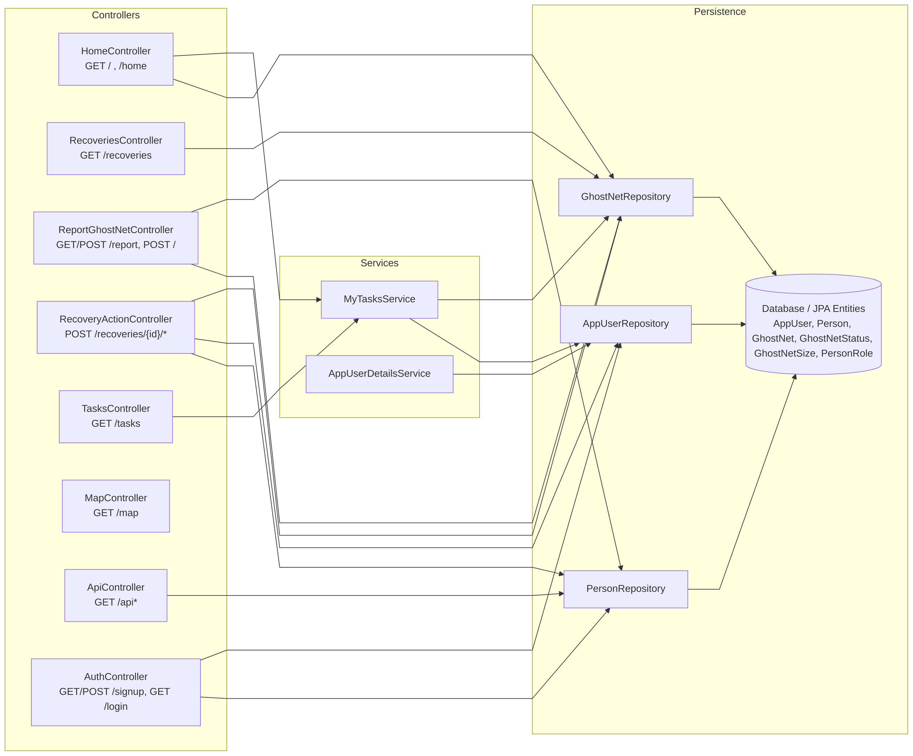

```mermaid
%%{init: {'flowchart': {'useMaxWidth': false, 'nodeSpacing': 60, 'rankSpacing': 85, 'padding': 18, 'curve': 'linear'}}}%%
graph LR
  %% Controllers and services
  subgraph Controllers
    direction TB
    HomeC["HomeController<br/>GET / , /home"]
    RecoveriesC["RecoveriesController<br/>GET /recoveries"]
    ReportC["ReportGhostNetController<br/>GET/POST /report, POST /"]
    RecoveryActionC["RecoveryActionController<br/>POST /recoveries/{id}/*"]
    TasksC["TasksController<br/>GET /tasks"]
    MapC["MapController<br/>GET /map"]
    ApiC["ApiController<br/>GET /api*"]
    AuthC["AuthController<br/>GET/POST /signup, GET /login"]
  end

  subgraph Services
    direction TB
    TasksSvc[MyTasksService]
    UserDetailsSvc[AppUserDetailsService]
  end

  %% Persistence
  subgraph Persistence
    direction TB
    AppUserRepo[AppUserRepository]
    PersonRepo[PersonRepository]
    GhostNetRepo[GhostNetRepository]
    Db[(Database / JPA Entities<br/>AppUser, Person, GhostNet, GhostNetStatus, GhostNetSize, PersonRole)]
  end

  %% Controllers -> Services
  HomeC --> TasksSvc
  TasksC --> TasksSvc

  %% Controllers -> Repos
  HomeC --> GhostNetRepo
  RecoveriesC --> GhostNetRepo
  ReportC --> PersonRepo
  ReportC --> GhostNetRepo
  RecoveryActionC --> GhostNetRepo
  RecoveryActionC --> AppUserRepo
  RecoveryActionC --> PersonRepo
  ApiC --> PersonRepo
  AuthC --> AppUserRepo
  AuthC --> PersonRepo

  %% Services -> Repos
  TasksSvc --> GhostNetRepo
  TasksSvc --> AppUserRepo
  UserDetailsSvc --> AppUserRepo

  %% Repos -> DB
  AppUserRepo --> Db
  PersonRepo --> Db
  GhostNetRepo --> Db
```
