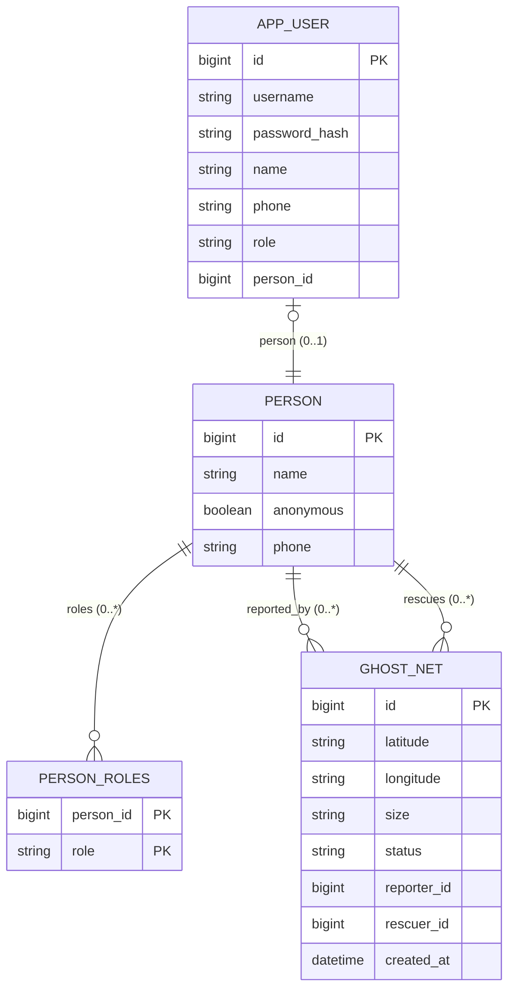

```mermaid
%%{init: {'er': {'layoutDirection': 'LR'}}}%%
erDiagram
  APP_USER {
    bigint id PK
    string username
    string password_hash
    string name
    string phone
    string role
    bigint person_id
  }

  PERSON {
    bigint id PK
    string name
    boolean anonymous
    string phone
  }

  PERSON_ROLES {
    bigint person_id PK
    string role PK
  }

  GHOST_NET {
    bigint id PK
    string latitude
    string longitude
    string size
    string status
    bigint reporter_id
    bigint rescuer_id
    datetime created_at
  }

  APP_USER |o--|| PERSON : "person (0..1)"
  PERSON ||--o{ PERSON_ROLES : "roles (0..*)"
  PERSON ||--o{ GHOST_NET : "reported_by (0..*)"
  PERSON ||--o{ GHOST_NET : "rescues (0..*)"
```

- `username` is unique; `person_id`, `reporter_id`, and `rescuer_id` are FKs. Enums (`GhostNetSize`, `GhostNetStatus`, `PersonRole`) are stored as strings.
