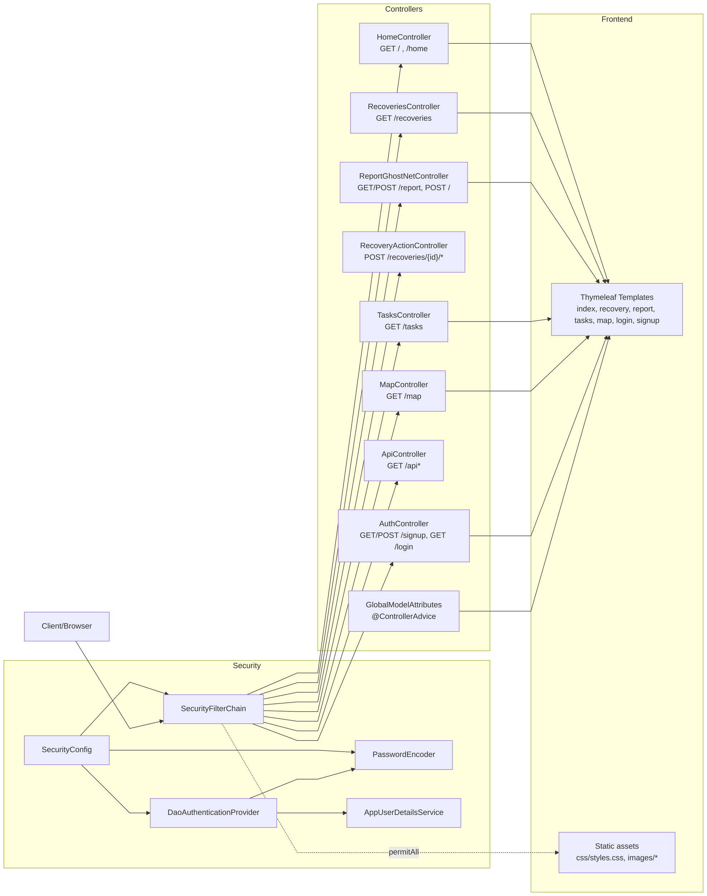

```mermaid
%%{init: {'flowchart': {'useMaxWidth': false, 'nodeSpacing': 60, 'rankSpacing': 85, 'padding': 18, 'curve': 'linear'}}}%%
graph LR
  %% Request entry + security
  Client[Client/Browser]
  subgraph Security
    SecConfig[SecurityConfig]
    FilterChain[SecurityFilterChain]
    DaoAuth[DaoAuthenticationProvider]
    PwdEncoder[PasswordEncoder]
    UserDetailsSvc[AppUserDetailsService]
  end
  SecConfig --> FilterChain
  SecConfig --> DaoAuth
  SecConfig --> PwdEncoder
  DaoAuth --> UserDetailsSvc
  DaoAuth --> PwdEncoder
  Client --> FilterChain

  %% Controllers
  subgraph Controllers
    direction TB
    HomeC["HomeController<br/>GET / , /home"]
    RecoveriesC["RecoveriesController<br/>GET /recoveries"]
    ReportC["ReportGhostNetController<br/>GET/POST /report, POST /"]
    RecoveryActionC["RecoveryActionController<br/>POST /recoveries/{id}/*"]
    TasksC["TasksController<br/>GET /tasks"]
    MapC["MapController<br/>GET /map"]
    ApiC["ApiController<br/>GET /api*"]
    AuthC["AuthController<br/>GET/POST /signup, GET /login"]
    GlobalAdvice["GlobalModelAttributes<br/>@ControllerAdvice"]
  end

  %% Frontend
  subgraph Frontend
    direction TB
    Templates["Thymeleaf Templates<br/>index, recovery, report, tasks, map, login, signup"]
    StaticAssets["Static assets<br/>css/styles.css, images/*"]
  end
  FilterChain -. permitAll .-> StaticAssets

  %% Flow: Security to controllers
  FilterChain --> HomeC
  FilterChain --> RecoveriesC
  FilterChain --> ReportC
  FilterChain --> RecoveryActionC
  FilterChain --> TasksC
  FilterChain --> MapC
  FilterChain --> ApiC
  FilterChain --> AuthC

  %% Controllers -> Templates
  HomeC --> Templates
  RecoveriesC --> Templates
  ReportC --> Templates
  TasksC --> Templates
  MapC --> Templates
  AuthC --> Templates
  GlobalAdvice --> Templates
```
